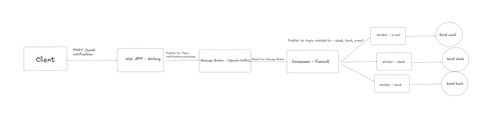

# Project Name
Notification Sending System
## Description

This project is backend software responsible for notification system for purchase. The objective of this application
is to respond to a HTTP request from a client to notify that a purchase has been made. The notification should be one-to-multiple
channels (slack, email, text).

The system has the following constraints:
 - Horizontally scalable.
 - At least once for sending message
 - Easy extendable for new channels

### Solution
With the above description, the following solution has been create:

[Apache Kafka](https://kafka.apache.org/) as message broker. When the backend receives a valid message,
it sends the message to Kafka. After the message is correctly persisted in Kafka, we return to the client
a HTTP status 200. To guarantee at least once constraint, I created the publisher/producer with a config that
the Kafka ACK is only sent when a minimium of replicas commited the message. To consume this messages, I created
a module called consumer, a CLI app that spawn a new consumer, responsible for reading a Kafka topic. For the system
design required for this project, I created two kinds of consumer: fanout and worker. A fanout is responsible for read a topic
from Kafka that contain all notifications from users. When read this messages, the fanout is responsible for sending the message
for related topics, associated with a channel (e-mail, slack, text). With this architecture, we have two strong benefit:
it is possible to horizontally scale our application, creating new workers of the same type, and for creating a new kind of worker (that
integrates with a new channel), it is only needed the code to implement the integration with the channel, as the code related to the
worker will be reused. To guarantee and at least once when any consumer reads from a topic, we only forward the topic offset after the message is correctly processed.
 The image below represents the system descripted:


## Project limitations
- For this project, I created only the email worker. The
code can be easily adapt to create new workers. 
- I do not guarantee idempotency with this design. For future relases, we could provide a new HTTP method PUT, guaranting idempotency for a given transaction. For this, we would need to guarantee that a message is not processed twice for a given transaction.
- I did not implemented the client to send email. For this project, we only log the purchase payload.


## Requirements

- Go 1.24.2 or higher
- Docker and Docker-Compose

## Installation

```bash
git clone https://github.com/igorlousada/notification-system.git
cd notification-system
docker-compose up -d #run kafka single node container
cd app
go run main.go # create web application
#in a new terminal - create fanout consumer
cd consumer
go run main.go notification-purchase fanout
#in a new terminal - create email worker
go run main.go email-topic worker
```